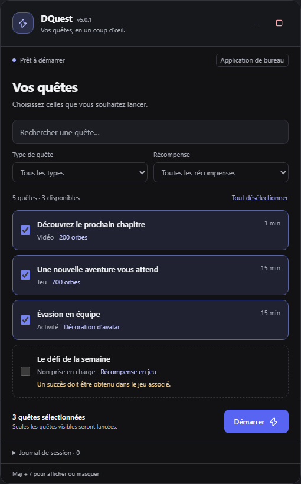
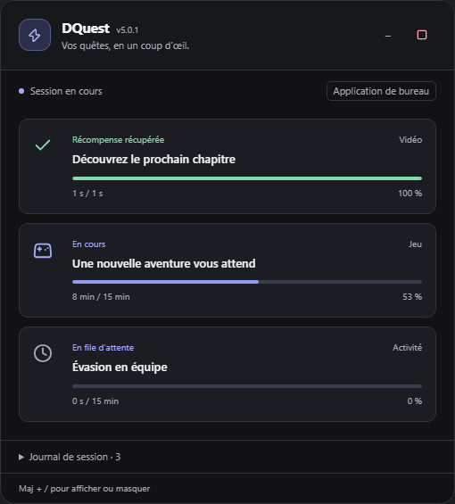
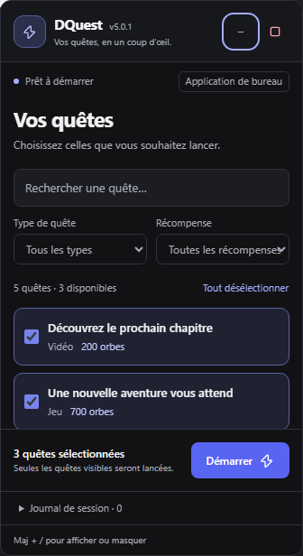
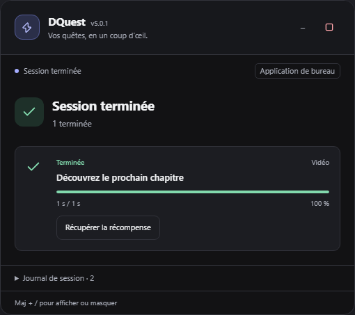
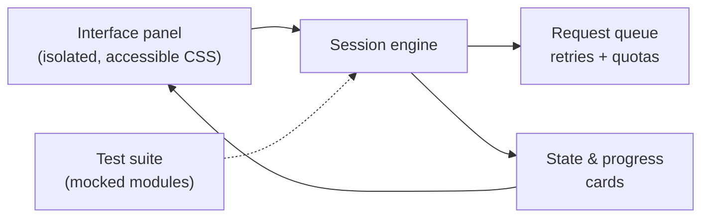

# DQuest — Discord Quest Dashboard Showcase

*[Lire en français](README.md)*

  
  
  
  

> **UI/UX interface showcase** for tracking and managing Discord quests. This public repository is a conceptual portfolio showcase presenting the interface design, ergonomics and visual architecture of the project.
>
> DQuest is a **complete, working project** (version 5.0.1): a standalone interface panel, an execution engine and an automated test suite. This repository only presents the visible part; the code is maintained in a private repository.

---

## 📸 Interface preview

| Quest selection and filters | Live tracking & progress |
| :---: | :---: |
|  |  |

| Compact / Mobile layout | Completion screen |
| :---: | :---: |
|  |  |

---

## ⚠️ Disclaimer & Terms of Service Compliance

> **ToS compliance note**:
> This repository is strictly informational, educational and for UI/UX presentation purposes. **No executable script, automation file or client injection method is hosted or distributed in this public repository**, in order to fully comply with Discord's Terms of Service (ToS) and the GitHub community guidelines.

---

## 🎨 Design & Interface Principles

The interface panel was designed to blend seamlessly into modern chat environments:

- **Consistent design system**: Anthracite palette with *blurple* accents, typography inspired by the communication ecosystem, subtle borders and careful contrast.
- **Instant filtering and search**: Accent- and case-insensitive search engine, thematic filters by task type and reward categorization.
- **Accessibility & ergonomics**:
  - Native support for full keyboard navigation.
  - Strict adherence to the user's reduced-motion preference (`prefers-reduced-motion`).
  - Fluid responsive layout from 320 px wide (resizable and draggable panel).
- **Persistent status cards**: Concise display of successes, possible failures, reasons for unavailability and details of rewards obtained.

---

## 📊 Technical Categorization

The system analyzes and structures the different mission formats offered by the platform:

| Category | Description & Characteristics |
| :--- | :--- |
| `WATCH_VIDEO` | Tracking of video content with display confirmation. |
| `PLAY_ON_DESKTOP` | Detection of runtime metadata on desktop environments. |
| `STREAM_ON_DESKTOP` | Tracking of streams shared in a voice channel with participants. |
| `PLAY_ACTIVITY` | Management of embedded activities and communication gateways. |
| `ACHIEVEMENT_IN_ACTIVITY` | Management of interactive paths and permission checks. |

---

## ⚙️ Under the Hood

DQuest is not a mere mockup: the interface is backed by a real execution engine.

- **Standalone panel**: a single unit, styles scoped to the component, draggable, resizable and collapsible.
- **Session engine**: explicit user selection, bounded parallel processing, a failing task isolated from the others, clean shutdown at any time.
- **Real progress**: the display follows the platform's responses, with no artificial counter.
- **Feature detection** rather than version detection: the panel shows a clear diagnostic when a prerequisite is missing.
- **Clean cancellation**: pauses, waits and subscriptions are released when the session stops.

## 🛡️ Resilience and Architecture

- **Network flow management**: Sequential queues with exponential backoff on transient errors.
- **Quota compliance**: Proactive detection and handling of global and per-endpoint HTTP 429 delays.
- **Task isolation**: Each task is processed in an independent context so that an isolated anomaly does not block the whole session.

---

## ✅ Quality & Tests

The project ships with its test suite, run without any account or external connection, using a simulated environment:

| Layer | Coverage |
| :--- | :--- |
| Engine | 32 unit tests (selection, queue, quotas, cancellation) |
| Ancillary services | 10 tests |
| Interface | 12 automated Chromium scenarios (320, 360 and 800 px views), which also generate the screenshots above |

The screenshots in this repository come from these scenarios, using fictitious data.

---

## 📄 License & Rights

This repository is a public demonstration showcase. All rights reserved.  
Discord is a registered trademark of Discord Inc. This project is neither affiliated with nor endorsed by Discord Inc.

## 👤 Credits

Developed by [bhpdev1](https://github.com/bhpdev1)
