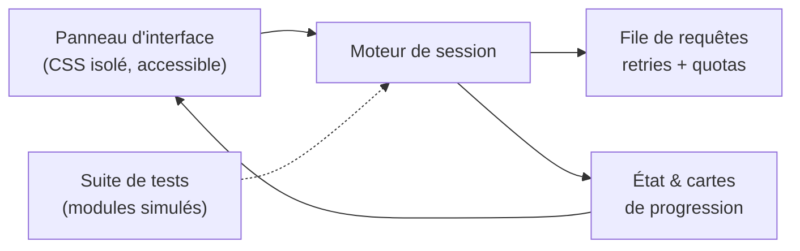

# DQuest — Discord Quest Dashboard Showcase

*[Read in English](README.en.md)*

  
  
  
  

> **Présentation d'interface & vitrine UI/UX** pour le suivi et la gestion des quêtes Discord. Ce dépôt public est une vitrine conceptuelle de portfolio présentant le design d'interface, l'ergonomie et l'architecture visuelle du projet.
>
> DQuest est un **projet complet et fonctionnel** (version 5.0.1) : un panneau d'interface autonome, un moteur d'exécution et une suite de tests automatisés. Ce dépôt n'en présente que la partie visible ; le code est maintenu dans un dépôt privé.

---

## 📸 Aperçu de l'interface

| Sélection et filtres des quêtes | Suivi en direct & progression |
| :---: | :---: |
|  |  |

| Format compact / Mobile | Écran de complétion |
| :---: | :---: |
|  |  |

---

## ⚠️ Avertissement & Respect des Conditions d'Utilisation

> **Note de conformité ToS** :
> Ce dépôt a un but exclusivement informatif, éducatif et de présentation UI/UX. **Aucun script exécutable, fichier d'automatisation ou méthode d'injection dans le client n'est hébergé ou distribué sur ce dépôt public**, afin de respecter pleinement les Conditions d'Utilisation (ToS) de Discord et les règles de la communauté GitHub.

---

## 🎨 Conception & Principes d'interface

Le panneau d'interface a été conçu pour s'intégrer harmonieusement dans les environnements de discussion modernes :

- **Design System cohérent** : Palette anthracite et touches *blurple*, typographie inspirée de l'écosystème de communication, bordures subtiles et contraste soigné.
- **Filtrage et recherche instantanée** : Moteur de recherche insensible aux accents et à la casse, filtres thématiques par type de tâche et catégorisation des récompenses.
- **Accessibilité & Ergonomie** :
  - Support natif de la navigation intégrale au clavier.
  - Respect strict des préférences utilisateur de réduction des mouvements (`prefers-reduced-motion`).
  - Adaptabilité responsive fluide dès 320 px de largeur (panneau redimensionnable et déplaçable).
- **Cartes d'état persistantes** : Affichage synthétique des réussites, échecs éventuels, motifs d'indisponibilité et détails des récompenses obtenues.

---

## 📊 Catégorisation technique

Le système analyse et structure les différents formats de missions proposés par la plateforme :

| Catégorie | Description & Caractéristiques |
| :--- | :--- |
| `WATCH_VIDEO` | Suivi des contenus vidéo avec confirmation d'affichage. |
| `PLAY_ON_DESKTOP` | Détection des métadonnées d'exécution sur environnement bureau. |
| `STREAM_ON_DESKTOP` | Suivi des flux partagés en salon vocal avec participants. |
| `PLAY_ACTIVITY` | Gestion des activités intégrées et passerelles de communication. |
| `ACHIEVEMENT_IN_ACTIVITY` | Gestion des parcours interactifs et vérification des autorisations. |

---

## ⚙️ Sous le capot

DQuest n'est pas une simple maquette : l'interface repose sur un moteur d'exécution réel.

- **Panneau autonome** : une seule unité, styles confinés au composant, déplaçable, redimensionnable et réductible.
- **Moteur de session** : sélection explicite par l'utilisateur, traitement en parallèle limité, échec d'une tâche isolé des autres, arrêt propre à tout moment.
- **Progression réelle** : l'affichage suit les réponses de la plateforme, sans compteur artificiel.
- **Détection de fonctionnalités** plutôt que de versions : le panneau affiche un diagnostic clair quand un prérequis manque.
- **Annulation propre** : pauses, attentes et abonnements sont libérés à l'arrêt de la session.

## 🛡️ Résilience et Architecture

- **Gestion des flux réseau** : Files d'attente séquentielles avec temporisation exponentielle en cas d'erreur transitoire.
- **Respect des quotas** : Détection et prise en compte proactive des délais HTTP 429 globaux et par point de terminaison.
- **Isolation des tâches** : Chaque tâche est traitée dans un contexte indépendant afin qu'une anomalie isolée ne bloque pas l'ensemble de la session.

---

## ✅ Qualité & tests

Le projet est livré avec sa suite de tests, exécutée sans compte ni connexion externe, avec un environnement simulé :

| Couche | Couverture |
| :--- | :--- |
| Moteur | 32 tests unitaires (sélection, file, quotas, annulation) |
| Services annexes | 10 tests |
| Interface | 12 scénarios Chromium automatisés (vues 320, 360 et 800 px), qui génèrent aussi les captures ci-dessus |

Les captures de ce dépôt proviennent de ces scénarios, avec des données fictives.

---

## 📄 Licence & Droits

Ce dépôt est une vitrine publique de démonstration. Tous droits réservés.  
Discord est une marque déposée de Discord Inc. Ce projet n'est ni affilié à, ni approuvé par Discord Inc.

## 👤 Crédits

Développé par [bhpdev1](https://github.com/bhpdev1)
